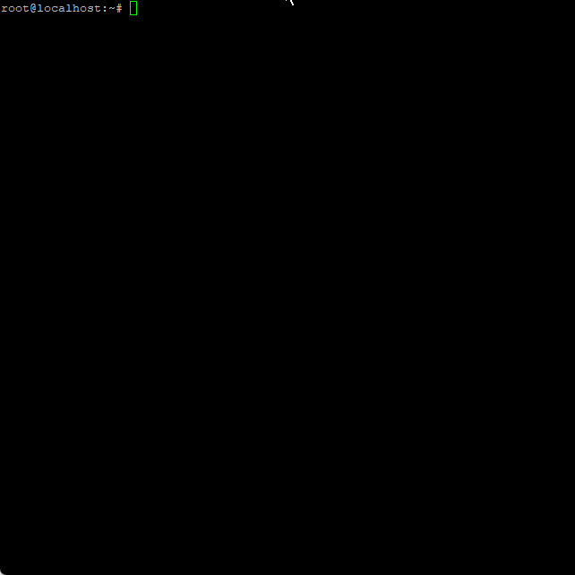

# Linux Server Utility Scripts
A set of small interactive scripts that can help you setup swapfiles and other things on your linux servers.


## Scripts

### Swapfile Setup
Allows you to easily setup a swapfile on your system by just giving it a path and a human-readable size.

All the size conversions and checks for available space are done automatically.

<details>
<summary>GIF Preview&nbsp;&nbsp;<i>(Click to open)</i></summary>

</details

**File:** [swapfile-util.sh](swapfile-util.sh)


## Usage
1. Clone the repository
```shell
git clone https://github.com/aziascreations/Bash-Linux-Server-Utilities.git
```

2. Setup the permissions
```shell
chmod +x Bash-Linux-Server-Utilities/*.sh
```

3. Run the desired script


## Licenses
This project is licensed under the [CC0 1.0 Universal (CC0 1.0) (Public Domain)](LICENSE-CC0) license.
